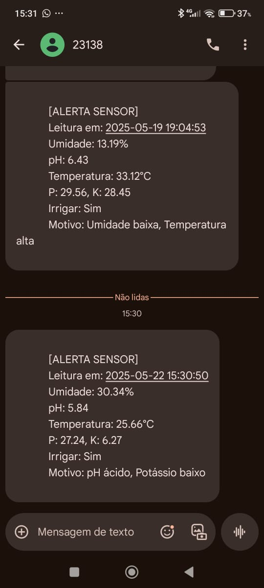
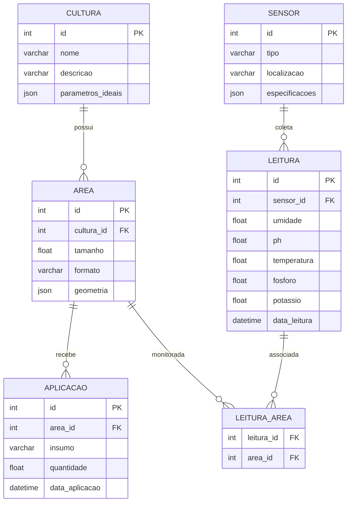

# 🌾 Dashboard de Gestão Agrícola Inteligente - Documentação Completa

## 📌 Visão Geral do Projeto

Este projeto é uma plataforma abrangente para gestão agrícola moderna que combina técnicas de agricultura de precisão, IoT, data science e visão computacional. O sistema foi desenvolvido para auxiliar agricultores e gestores rurais na tomada de decisões baseadas em dados, otimizando recursos e aumentando a produtividade.

## 🏗️ Arquitetura do Sistema

O dashboard é organizado em 5 módulos principais, cada um correspondendo a uma fase do desenvolvimento:

1. **Cálculos Básicos e Coleta de Dados**
2. **Modelagem e Estruturação de Banco de Dados**
3. **Automação e IoT para Irrigação Inteligente**
4. **Análise Preditiva com Data Science**
5. **Monitoramento com Visão Computacional**

## 🧩 Módulos Detalhados

### 1. Base de Dados e Coleta (Módulo de Cálculos Agrícolas)

#### Funcionalidades:
- **Cálculo de Área de Cultivo**:
  - Suporte para formas retangulares e circulares
  - Cálculo automático de área com visualização imediata
  - Entrada de medidas em metros com validação

- **Gestão de Insumos**:
  - Seleção de cultura (Milho, Feijão, Cana-de-açúcar)
  - Cálculo preciso de quantidade de insumos por m²
  - Conversão automática para litros/hectare
  - Sistema de salvamento de cálculos

- **Planejamento de Infraestrutura**:
  - Cálculo automático de ruas de acesso
  - Dimensionamento de corredores com largura ajustável
  - Estimativa de área ocupada por infraestrutura

#### Tecnologias Utilizadas:
- Streamlit para interface
- Matemática espacial para cálculos
- Armazenamento em sessão para histórico

### 2. Estruturação dos Dados (Modelo Relacional)

#### Componentes:
- **Diagrama Entidade-Relacionamento**:
  - Visualização interativa do modelo de dados
  - Legenda explicativa para todas as entidades

- **Documentação Completa**:
  - Descrição detalhada de cada tabela:
    - CULTURA: Cadastro de espécies vegetais
    - AREA: Mapeamento de talhões e áreas cultivadas
    - APLICACAO: Registro de aplicações de insumos
    - SENSOR: Inventário de dispositivos IoT
    - LEITURA: Armazenamento de dados coletados

- **Relacionamentos**:
  - Explicação das chaves estrangeiras
  - Cardinalidades e regras de negócio
  - Fluxo de dados entre entidades

### 3. IoT & Automação (Sistema de Irrigação Inteligente)

#### Funcionalidades Principais:
- **Simulação de Sensores em Tempo Real**:
  - Geração de dados aleatórios dentro de parâmetros realistas
  - Monitoramento de umidade, pH, temperatura e nutrientes

- **Lógica de Decisão para Irrigação**:
  - Algoritmo baseado em múltiplas variáveis
  - Limiares ajustáveis para cada cultura
  - Sistema de alertas com priorização

- **Integração com AWS SNS**:
  - Envio de SMS para alertas críticos
  - Formatação automática de mensagens
  - Registro de notificações enviadas



- **Visualização de Dados**:
  - Gráficos temporais interativos
  - Exportação para CSV
  - Histórico completo de leituras

#### Parâmetros Monitorados:
| Sensor        | Faixa Normal   | Unidade | Ação Trigger          |
|---------------|----------------|---------|-----------------------|
| Umidade       | 30-80%         | %       | <30% irrigar          |
| Temperatura   | 18-35°C        | °C      | >30°C alerta          |
| pH            | 5.5-7.5        | -       | <6.0 corrigir        |
| Fósforo (P)   | 10-40          | ppm     | <10 fertilizar       |
| Potássio (K)  | 15-50          | ppm     | <15 fertilizar       |

### 4. Data Science (Análise Preditiva)

#### Fluxo de Trabalho:
1. **Coleta de Dados**:
   - Importação de datasets históricos
   - Limpeza e pré-processamento automático

2. **Visualização Exploratória**:
   - Gráficos temporais interativos
   - Histogramas de distribuição
   - Correlação entre variáveis

3. **Modelagem Preditiva**:
   - Previsão de umidade do solo
   - Recomendação de irrigação
   - Cálculo de duração ideal

4. **Treinamento de Modelos**:
   - Interface para retreinamento
   - Validação cruzada
   - Serialização de modelos

#### Técnicas Utilizadas:
- Random Forest para regressão
- Normalização de características
- Validação temporal

### 5. Visão Computacional (Detecção com YOLOv8)

#### Fluxo Completo:
1. **Preparação do Ambiente**:
   - Configuração automática de diretórios
   - Carregamento de modelo pré-treinado

2. **Upload de Imagens**:
   - Suporte a múltiplos formatos (JPG, PNG)
   - Pré-visualização das imagens
   - Gerenciamento de arquivos

3. **Processamento**:
   - Detecção em lote
   - Ajuste de confiança mínima
   - Processamento em GPU (se disponível)

4. **Saídas e Relatórios**:
   - Visualização de bounding boxes
   - Estatísticas de detecção
   - Exportação de resultados

#### Configurações YOLOv8:
```yaml
model: yolov8s.pt
imgsz: 320
epochs: 45
batch: 16
conf: 0.25
```

## 🚀 Como Executar o Projeto

### Pré-requisitos
- Python 3.8 ou superior
- GPU NVIDIA (recomendado para YOLOv8)
- Conta AWS (para serviço SNS)

```

## 📊 Estrutura do Banco de Dados



---
## 🔗 Links

[YOUTUBE](https://youtu.be/zvX2aFcnEJ8?si=7VkqUQApzo-sNudC)

---

## 👨‍💻 Desenvolvido por

Lauriano – Estudante FIAP | Engenharia de Machine Learning  